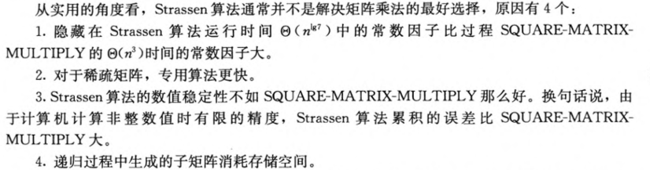

# 矩阵乘法之 Strassen

`CLRS 43p`
`DSAA 285p` 一些运算问题的理论改进

## pseudocode for Strassen's algorithm

```
STRASSEN(A, B)
    n = A.rows
    if n == 1
        return a[1, 1] * b[1, 1]
    let C be a new n × n matrix
    A[1, 1] = A[1..n / 2][1..n / 2]
    A[1, 2] = A[1..n / 2][n / 2 + 1..n]
    A[2, 1] = A[n / 2 + 1..n][1..n / 2]
    A[2, 2] = A[n / 2 + 1..n][n / 2 + 1..n]
    B[1, 1] = B[1..n / 2][1..n / 2]
    B[1, 2] = B[1..n / 2][n / 2 + 1..n]
    B[2, 1] = B[n / 2 + 1..n][1..n / 2]
    B[2, 2] = B[n / 2 + 1..n][n / 2 + 1..n]
    S[1] = B[1, 2] - B[2, 2]
    S[2] = A[1, 1] + A[1, 2]
    S[3] = A[2, 1] + A[2, 2]
    S[4] = B[2, 1] - B[1, 1]
    S[5] = A[1, 1] + A[2, 2]
    S[6] = B[1, 1] + B[2, 2]
    S[7] = A[1, 2] - A[2, 2]
    S[8] = B[2, 1] + B[2, 2]
    S[9] = A[1, 1] - A[2, 1]
    S[10] = B[1, 1] + B[1, 2]
    P[1] = STRASSEN(A[1, 1], S[1])
    P[2] = STRASSEN(S[2], B[2, 2])
    P[3] = STRASSEN(S[3], B[1, 1])
    P[4] = STRASSEN(A[2, 2], S[4])
    P[5] = STRASSEN(S[5], S[6])
    P[6] = STRASSEN(S[7], S[8])
    P[7] = STRASSEN(S[9], S[10])
    C[1..n / 2][1..n / 2] = P[5] + P[4] - P[2] + P[6]
    C[1..n / 2][n / 2 + 1..n] = P[1] + P[2]
    C[n / 2 + 1..n][1..n / 2] = P[3] + P[4]
    C[n / 2 + 1..n][n / 2 + 1..n] = P[5] + P[1] - P[3] - P[7]
    return C
```

## 当 n 不是偶数时算法的一点调节

We can just extend it to an $n\times n$ matrix and pad it with zeroes. It's obviously $\Theta(n^{\lg7})$

## 适用条件

