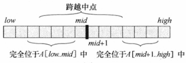
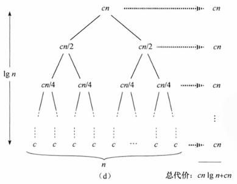

# 最大子数组问题

元素为 N 的数组，求它的一个最大子数组

`CLRS 38p`

==最大子数组的边界分为以下三种情况==



==代码==

```
call MaxSubSum(A, Left, Right)

    1. MaxLeftSum = MaxSubSum(A, Left, Center);
    2. MaxRightSum = MaxSubSum(A, Center + 1, Right);
    3. 
       {
           从 Center 开始向两边遍历，确定跨越中点情况的最大值
       }
    4. return MAX(1, 2, 3)
```

==时间复杂度==

O(NlogN)

递归的级数为层，每一层进行 N 的遍历（即对代码中 3 的执行），一共有 logN 层



==进阶==

O(N)

```c
int MaxSubsequenceSum(const int A[], int N)
{
    int ThisSum, MaxSum, j;

    ThisSum = MaxSum = 0;
    for (j = 0; j < N; j++)
    {
        ThisSum += A[j];

        if (ThisSum > MaxSum)
        {
            MaxSum = ThisSum;
        }
        else if (ThisSum < 0)
        {
            ThisSum = 0;
        }
    }
    return MaxSum;
}
```