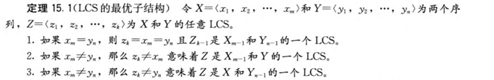
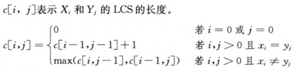
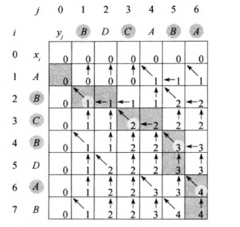
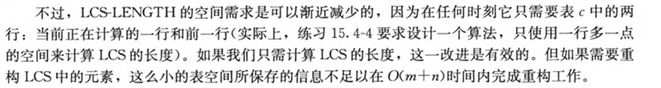
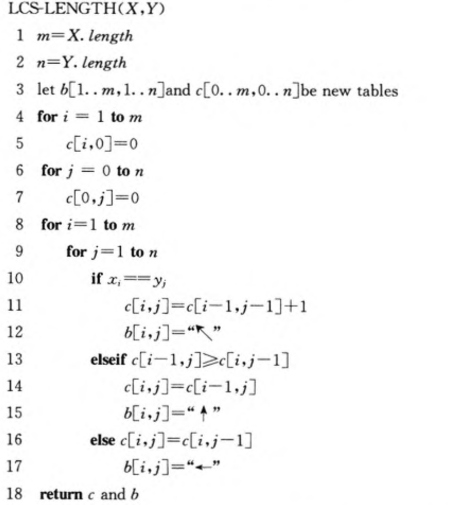

# 最长公共子序列

Longest-common-subsequence problem

$X = < A,B,C,B,D,A,B >,Y = < B,D,C,A,B,A >$

那么序列 $< B,C,B,A >$ 就是 X 和 Y 的公共子序列

## 原理

$X_{m}$ 表示 $X$ 长度为 $m$ 的前缀

$LCS[i, j]$ 表示 $X_{i}$ 和 $Y_{j}$ 的 LCS

$c[i, j]$ 表示 $X_{i}$ 和 $Y_{j}$ 的 LCS.lenth

由 `1.` 得出状态转移方程 `2.`

1. 
   - 举例
   - 如果 $x_{m} \not = y_{m}\ \And\And \ x_{m} \not = z_{k}$，那么 $LCS[m][n]$ 完全等同于 $LCS[m-1][n]$
   - 

2. 

## 迭代

## 时间复杂度

$O(mn)$ ( 两个序列的长度乘积 )

## 代码

