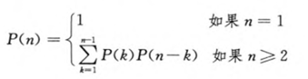

# 矩阵乘法的顺序安排

$P(n)$ 为 $n$ 个矩阵相乘的加括号种类数

状态转移方程如下

用假设带入法知 $P(n)=\Omega(2^n)$

**动态规划优化：与 `OptimalBST` 思路一模一样**

## 原理

若最后一次乘法为 $(A_{left}A_{left+1}\cdots A_i)(A_{i+1}A_{i+2}\cdots A_{right})$

若 $M_{left,right}$ 为从 $left$ 到 $right$ 的最佳乘法次数

$M_{left,right}= min\lbrace M_{left,i}+M_{i+1,right}+c_{left-1}c_{i}c_{right} \rbrace$

## 迭代图

与 `OptimalBST` 一样

## 时间复杂度

$O(n^3)$

## 代码

见 `ADAT/Optimal chain-matrix-multiplication`