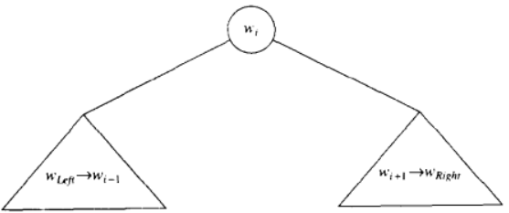
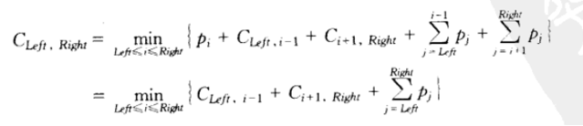
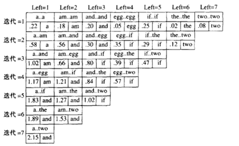

# 最优二叉查找树

给定一列单词 $w_1, w_2, \cdots, w_n$ 和它们出现的固定的概率 $p_1, p_2, \cdots, p_n$，以一种方法在一棵二叉查找树中安放这些单词使得总的期望访问时间最小

与 Huffman 编码树不完全一样，因为 $w$ 的下标要满足二叉查找树的次序条件

`DSAA 292p`

## 原理

设 $C_{left,right}$ 为最优期望

若某一刻 $\omega_i$ 为根

则

即遍历 $Left\ to\ Right$ 找到合适的 $i$

## 迭代图

如图 前 6 次迭代记录中间量

以动态归化的思想记录这些中间量，以助于下一次迭代的进行

当第 7 次迭代完成后，**得到了 `a..two` 的最优答案**，且以 `and` 为根

## 时间复杂度

虽然暴力讨论了所有的可能性

但是动态规划创建的表为下一层的迭代省下了时间

$O(n^3)$

## 代码

见 `ADAT/OptimalBST`