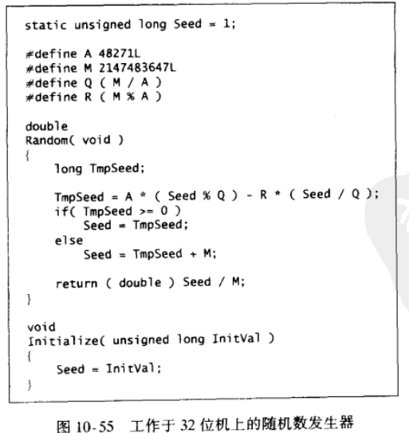

# 随机数生成

## 原理

产生简单随机数的最简单方法是线性同余数发生器

$x_{i+1}=Ax_{i}\ mod\ M$

等价

$x_{i+1}=A(x_i\ mod\ Q)-R(x_i/Q)+M\sigma(x_i)$

你会发现等式右边前两项不会溢出

等式右边最后一项不用算，根据前两项的值决定它为 $M$ 或 $0$

- 当 $M \And A$ 的取值好时， $x_{i}$ 的一系列值很好，**鸽巢原理**
- 在 $M = 2^{31}-1 \And A=48271$ 时，$x_{i}$ 的循环会尽可能的长

## 代码

见 `ADAT/Random.c`