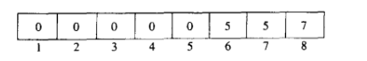
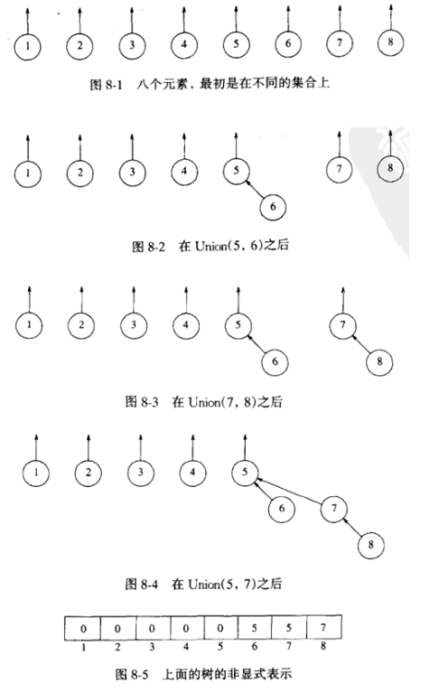
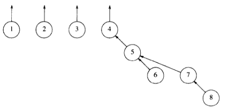
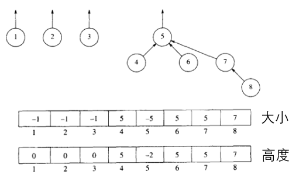
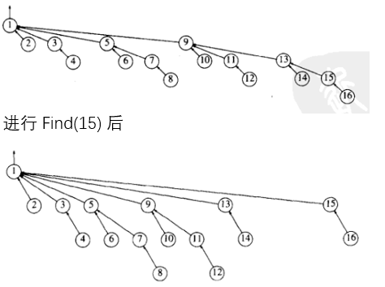

#! https://zhuanlan.zhihu.com/p/443838992
- [不相交集 (disjointSet)](#不相交集-disjointset)
  - [Find](#find)
  - [Union](#union)
  - [算法的进阶](#算法的进阶)

---

[回到首页](https://zhuanlan.zhihu.com/p/440338367) ( 进行大纲阅读和相关资源获取 )

---

# 不相交集 (disjointSet)
也叫查并集

**记录元素等价关系的结构**

核心操作是 `Find` 和 `Union`

> 本次我们讨论一种 `Union` 运算容易，但 `Find` 操作复杂一些的方式
> 
> 数组的下标对应某元素
> 
> 数组的值对应某元素所在的集合
> 
> 跳出递归的信息是数组的值 <0

## Find 
返回元素 x 所在的集合

`Find(a)==Find(b)` 当且仅当 ab 在同一个集合

我们不关心具体 `Find(a)` 或 `Find(b)` 是多少，我们更在意 `Find(a)==Find(b)` 是否成立



如上图， $[1]=\{1\},[5]=\{5,6,7,8\}$ ( 这个式子的意思在离散数学里面已经有过定义 )

```c
SetType Find(ElementType X, DisjSet S)
{
    if (S[X] <= 0)
        return X;
    else
        return Find(S[X], S);
}
```

## Union
合并两个等价类



```c
/* 注意这里的参数并不是 ElementType , 而是 SetType */
/* 传进函数的参数已经是集合这个类型了 */
void SetUnion(DisjSet S, SetType Root1, SetType Root2)
{
    S[Root2] = Root1;
}
```

## 算法的进阶
① 求并的进阶 (Union)

在之前我们的求并就单是 `S[Root2] = Root1;`

这样可能出现糟糕的情况

如上例，再进行一次 `Union(4,5)`,得到



你会发现我们想要 `Find(8)` 时，会进行很长的递归调用，`Find()` 性能低

解决办法：

1. 按大小求并
2. 按高度求并 ( 代码已实现 )

如下图，用负值来记录一个集合的大小或高度，合并时添一个判断就好

所以再进行一次 `Union(4,5)` ，得到



```c
/* 按高度求并 */
/* 根元素的负值表该树的高 */
void SetUnion(DisjSet S, SetType Root1, SetType Root2)
{
    if (S[Root2] < S[Root1]) /* Root2 is deeper set */
    {
        S[Root1] = Root2; /* Make Root2 new root */
    }
    else
    {
        if (S[Root1] == S[Root2]) /* Same height, */
        {
            S[Root1]--; /* so update */
        }
        S[Root2] = Root1;
    }
}
```

② 路径压缩 (Find)

通过对 `Find()` 做些聪明的工作，我们实现了下面的功能



```c
SetType Find(ElementType X, DisjSet S)
{
    if (S[X] <= 0)
    {
        return X;
    }
    else
    {
        return S[X] = Find(S[X], S);
    }
}
```

**路径压缩**与**按大小求并**完全兼容。

**路径压缩**与**按高度求并**不完全兼容，因为压缩之后，我们根本不清楚如何有效的更新它们的高度。所以在这两个例程同时实现时，我们往往认为高度只是一个估计值。( 有时称它为秩--rank )

---