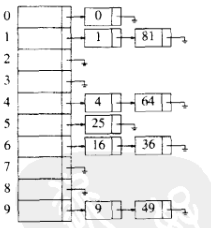
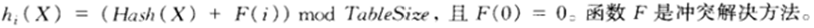
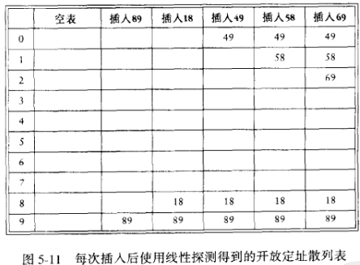
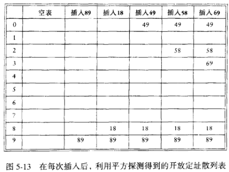
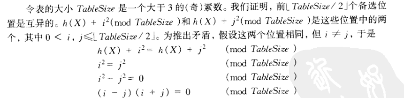
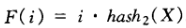
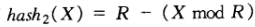

#! https://zhuanlan.zhihu.com/p/440781368
- [散列表 (hash)](#散列表-hash)
  - [解决冲突](#解决冲突)
      - [1) 分离链接法](#1-分离链接法)
      - [2) 开放定址法](#2-开放定址法)
      - [3) 双散列](#3-双散列)
  - [再散列](#再散列)
  - [可扩散列](#可扩散列)

---

[回到首页](https://zhuanlan.zhihu.com/p/440338367) ( 进行大纲阅读和相关资源获取 )

---

# 散列表 (hash)
以常数时间执行插入，删除和查找的技术 (Insert,Find,Delete)

**两个不同的关键字映射到不同的单元**

整个实现在 `ADT/hash_`

> 有一点值得注意：
> 
> 我们设定表的大小总是偏向于设为素数：
> 
> 其一，在 Key 具有一些奇奇怪怪的性质时，hash(Key) 的结果更好，容错率高
> 
> 其二，在解决冲突时效率会更高。特别是在平方探测法解决冲突时，素数的需求几乎是必需的，详见下文
> 
> 比如：
> 
> 当我们需要一个大小为 20 的散列表时，一般会申请一个大小为 23 的散列表 

---

## 解决冲突
散列的要点在于解决冲突

我们定义

**装填因子**：散列表中的元素个数与散列表的大小比值

#### 1) 分离链接法
将散列到同一个值的所有元素保留到一个链表中

表的大小尽量与预估元素个数一样

即尽量保证 **装填因子** $\lambda$ = 1

这样使得查找快，至于证明我就不写了。其一，别人证过的东西我没必要再在上面花时间了，人生苦短；其二，不会，目前我的水平还无法质疑这个结果，管他那么多干什么，信它就对了

比如：**Hash(X) = X mod 10**



```c
/* 链表 */
/* 值得注意的是本次实现的链表都有头节点 */
struct ListNode
{
    ElementType Element;
    Position Next;
};
/* hash */
struct HashTbl
{
    int TableSize;
    struct ListNode* *TheLists; //指针的指针 
    //就是这个 TheLists 有点绕，提前给你们一个高能预警，在阅读代码的时候还请放宽心态
};
```

#### 2) 开放定址法


装填因子 $\lambda<0.5$ 是我们比较喜欢的

在这个方法下，标准的删除是有问题的，我们采用懒惰删除 ( 很显然，根据方法的定义 )

懒惰删除：当一个元素要被删除时，它仍然留在表中，只是做一个删除的记号 ( 通过代码理解吧 )

① 线性探测法 ( 这个的代码没有，原理跟 ② 差不多且更简单 )

$F(i) = i$

大致原理就是

比如：**Hash(Key) = Key mod 10**



这个方法有个问题

就算在某些 Key 不理想时，插入会很慢，且导致 **一次聚集** 现象

上图应该能明显反应出 **一次聚集** ( 某一块位置上都有元素，另一块位置上全是空的 )

而插入慢在于比如插入 69 时 ，进行了 4 次查找，与理想中次数还是有较大差距

特别是当表更大，元素更多时，这种效果更加明显

所以我们引入 **平方探测法**

② 平方探测法

$F(i) = i^2$



这个方法一定程度弥补了 ① 的不足，解决了 **一次聚集** 问题

但 **二次聚集** 问题依然在( 即散列到同一位置上的元素将探测相同的备选单元 ) 

```c
/* 枚举定义一个位置的状态 */
/* 因为我们采用懒惰删除，所以这点很重要 */
enum KindOfEntry
{
    // 0 1 2
    Legitimate,
    Empty,
    Deleted
};

struct HashEntry
{
    ElementType Element;
    enum KindOfEntry Info;
};

typedef struct HashEntry Cell;

/* Cell *TheCells will be an array of HashEntry cells, allocated later */
struct HashTbl
{
    int TableSize;
    Cell *TheCells;
};
```


> 下面有个重点也是难点
> 
> 对于方法 ① ，当表越满，插入就会越慢，这是显然的
> 
> 对于方法 ② ，情况更糟，一旦表被填满超过一半，就不能保证新元素能够被成功插入了
> 
> 在证明之前，我们应该先搞清楚什么是备选位
> 
> 拿上图举例：
> 
> 比如要插入89 (平方探测法)
> 
> 那么它的第一个备选位在散列表中的位置是9，第二个备选位在散列表中的位置是 (9+1)%10=0，第三个备选位在散列表中的位置是 (9+4)%10=3
> 
> 下面是证明 (详见p119)
> 
> 我们证明前 $TableSize/2$ 个备选位是互异的
> 
> 已知 ①使用平方探测法 ②表大小为素数 
> 
> > $i$ 表示关键字 $X$ 第 $i$ 个备选位
> > 
> > $h(X)+i^2 (mod TableSize)$ 表示它在散列表中的位置
> > 
> > $h(X)+i^2=h(X)+j^2\quad(mod \quad TableSize)$ 表示第 $i$ 个备选位和第 $j$ 个备选位在散列表中是同一个位置
> 
> 
> 
> 由于 $TableSize$ 是素数 
> 
> $(i-j)(i+j)=0\quad(mod \quad TableSize)$ 表明 $(i-j)(i+j)$ 是 $TableSize$ 的倍数
> 
> 即 ①要么 $i+j$ 是 $TableSize$ 的倍数 , ②要么 $i-j$ 是 $TableSize$ 的倍数
> 
> 由于 $0<i+j<TableSize$ 所以否定 ①  ( 假设中取 $0 \leq i\leq j<TableSize/2$ )
> 
> 由于 $0<|i-j|<TableSize$ 所以否定 ②
> 
> 这样一来假设不成立
> 
> 前 $TableSize/2$ 个备选位应该是互异的
> 
> 因此，当散列表剩余位置大小一半，是完全可以插入新的元素
> 
> 所以时刻保证表的剩余位置有一半是必要的
> 
> 这是一个比较典型的空间换时间
> 
> 为了保证快的查找
> 
> 我们放弃了一半表大小的空间
> 
> 我尽量解释了 (doge)

最后还有一点

因为平方探测发的这个特性

我们额外提供了一个函数 `Rehash()`

创建一个大小为原来 2 倍的新表

再把原表的元素重新插入新表

这可能会额外消耗一点时间

但是值得的

#### 3) 双散列


两个注意点

* 函数值不能算得为 0
* 保证所以单元都能被探测

好一点的选择，诸如



(R为小于TableSize的素数)

$hash_2()$ 选择得不好会导致灾难

怎么说呢，我不会选这个 $hash_2()$

所以我不用双散列

---

## 再散列
这个我们已经在 **平方探测法** 中提到

大概就是通过扩大表的大小来提高插入的性能

再散列大约有三个标准
1. 表填了一半就再散列
2. 插入失败时再散列
3. 当装填因子大于某个值时再散列 ( 根据定义来讲，装填因变大，散列的性能会下降 )

---

## 可扩散列
我是垃圾，不会

---