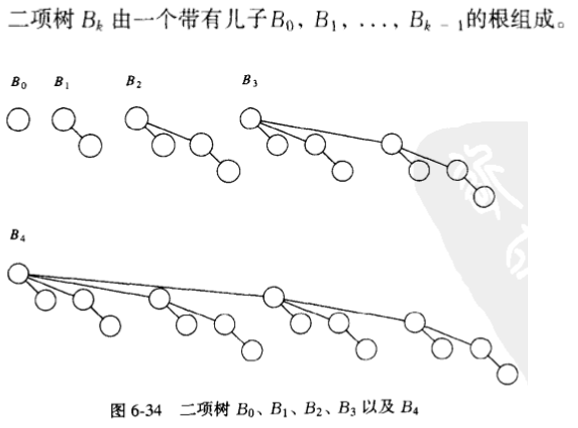
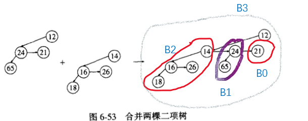

- [优先队列/堆 (heap)](#优先队列堆-heap)
  - [一些简单的实现](#一些简单的实现)
  - [二叉堆](#二叉堆)
      - [性质](#性质)
      - [基本操作](#基本操作)
  - [左式堆](#左式堆)
      - [性质](#性质-1)
      - [定理](#定理)
      - [基本操作](#基本操作-1)
  - [斜堆](#斜堆)
  - [二项队列](#二项队列)
      - [结构](#结构)

---

# 优先队列/堆 (heap)

一类特别的队列(queue)

按照元素的优先权出队


代码见 `ADT/heap_`

## 一些简单的实现

① 简单链表：在表头以 $O(1)$ `Insert` , 遍历链表以 $O(N)$ `DeleteMin`

② 有序的链表：始终让表保持有序性，遍历链表以 $O(N)$ `Insert` ，$O(1)$ `DeleteMin`  

② 二叉查找树：以 $O(\log N)$ 完成 `Insert && DeleteMin`

## 二叉堆

#### 性质

① **结构性**

这个二叉堆是一个完全二叉树

一个高 $h$ 的完全二叉树有 $[2^h,2^{k+1}-1]$ 个节点

这意味着它高是 $\log N$ ，是一颗性质很好的树

由于它的规律性很强，完全可以用数组来实现，省去指针的开销

在任一位置 $i$ 上的元素，其左儿子在位置 $2i$ 上，右儿子在 $2i+1$ 上 ( 这一点是显然的 )


② **堆序性**

对于每一个节点 X ，X 的父亲中的关键字小于或等于 X 的关键字

这个性质表明，堆的最小元总在根处

```c
struct HeapStruct
{
    int Capacity;
    int Size;
    ElementType *Elements;
};
```

#### 基本操作

`Insert`


`DeleteMin`


`DecreaseKey`/`IncreaseKey`

增加/降低某关键字的优先级

`Delete`

从堆中删去某个关键字

`BuildHeap`

把一些关键字作为输入放入空堆，两种想法 

1. N 次相继的插入
2. 将 N 个关键字以任意顺序放入树中，然后一定规律地进行关键字下滤，如下

除树叶外有 7 个节点，依节点位置从后到前下滤节点


它的**时间运行界**应该为：$O(N)$ ( 堆中所有节点的高度和，证明详见p141 )

## 左式堆

优点 : 能合并两个堆

不足 : 处理指针使得其他操作变慢

#### 性质

① 堆序性 ( 见二叉堆 )

② 对于堆中的每一个节点 X , 左儿子的零路径长**至少**与右儿子零路径长一样长

直观上 : 左边比右边更快到树叶 ( 性质决定了趋向于加深左路径 )

(零路径长-NPL : **一个节点**到**一个没有两个儿子节点**的路径长 , 最短)


```c
struct TreeNode
{
    ElementType Element;
    PriorityQueue Left;
    PriorityQueue Right;
    int Npl;
};
```

#### 定理

在右路径上有 r 个节点的左式树必然至少有 $2r-1$ 个节点 ( 证明见p146 )

#### 基本操作

我们着重考查合并 `Merge` ( 注意 `Insert` 在这里便是 `Merge` 的特殊情况 )

核心思想：**具有大的根值的堆与具有小的根值的堆的右子树合并** ( **这样的结果一定会保持堆序性，但根的左氏堆性质可能会被破坏** )

关于合并的步骤大致如下：

* 具有大的根值的堆与具有小的根值的堆的右子树合并
* 若根处左氏堆的性质被破坏，`Swap(H->right,H->left)`
* 更新根处的 Npl

关于具体流程演示的例子我没找到，抱歉 :pensive:

时间复杂度与右路径长成正比 , 即 $O( \log N )$

## 斜堆

什么情况下都交换左右的位置，不保留路径长的数据

> `斜堆` 之于 `左氏堆` 正如 `伸展树` 之于 `AVL 树`
> 
> 但是我是辣鸡不会 `斜堆` 正如我不会 `伸展树`

## 二项队列

最后我们讲讲二项队列，个人认为形式最美的一种结构

#### 结构

一个**二项队列**由一系列**二项树**构成

一颗**二项树**便是图中的 $B_i$



由这种定义可知，无论二项队列有多少个元素，都可以唯一地由一种 $B_i$ 的组合组成

(2) 合并


(3) 插入


(4) 删除最小元

删除最小元，原队列一分为二，合并裂开后形成的队列 $H'$，$H''$，得到最终结果


(5) 实现中每棵树的存储方式




```c
/* 单个节点的原型 */
struct BinNode
{
    ElementType Element;
    Position LeftChild;
    Position NextSibling;
};
```
```c
/* 整个队列的原型 */
struct Collection
{
    int CurrentSize;
    BinTree TheTrees[MaxTrees]; // TheTrees : 指针的指针
};
```

在本次实现中，我们默认 `MaxTrees`  为 14 , 即该队列能存储 $2^{14}-1$ 个元素 , 具体的数值你可以根据需求而改
