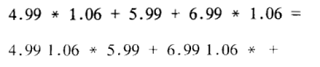

- [表、栈和队列 (list)](#表栈和队列-list)
  - [表](#表)
      - [关于表的常见操作](#关于表的常见操作)
      - [表的存储结构](#表的存储结构)
  - [栈](#栈)
      - [实现方式](#实现方式)
      - [应用](#应用)
  - [队列](#队列)

---

# 表、栈和队列 (list)

代码见 `ADT/list_`

## 表

表应该算是入门的数据结构

基本原理和代码实现整体难度不大

#### 关于表的常见操作

|             常见操作名称 | 函数名字      |
| -----------------------: | :------------ |
| 线性表的创建和初始化过程 | ,             |
|               线性表长度 | ,             |
|             打印每个元素 | PrintList     |
|         清除结构中的元素 | MakeEmpty     |
|     根据位序得到数据元素 | Findkth       |
|     查找某个元素是否存在 | Find          |
|       插入数据和删除数据 | Insert Delete |

#### 表的存储结构

以下为物理地址上的存储分类

**① 链式存储结构**

代表示例：单链表，双链表等一系列链表

**② 顺序存储结构**

代表示例：数组

> 值得一提的是**静态链表**
> 
> 又叫链表的游标实现
> 
> 它的整体占用物理空间情况类似数组
> 
> 而单个元素在物理上的分布类似链表
> 
> 我的笔记是 "用于不支持指针的语言"

## 栈

栈的关键字是 **"先入后出"**

#### 实现方式
* 链表
* 数组

```c
struct StackRecord
{
    int Capacity;
    int TopOfStack;
    ElementType *Array;
};
```


> 我的笔记中只附有**数组的实现方式**
> 
> 数组实现应该说是比较简单且便捷
> 
> 不过应当记得进行数组是否越界的检查

#### 应用
关于栈最典型的应用应当是实现**四则混合运算**

1. 中缀表达式转化为后缀表达式
2. 由后缀表达式计算结果

详细算法思路可以参考 `p73`

整个程序已经实现，收录在 `applications_adt/Operations-in-Stack.c`

> 中缀与后缀  
> 
> 

---

## 队列
队列的关键字是 **"先进先出" "尾进首出"**

几个注意事项
* 数组实现时对越界行为是否发生的检查
* 记得定义一个初始状态(这个没有统一标准)

比如有人习惯 `Rear` 指向下一个空位，有人习惯 `Rear` 指向最后入队的元素

你应该明白初始化时 `Rear&Front` 的关系并不重要，不同的人习惯不同的初始方式。我们更加在意的是 `Dequeue:Rear++ ` `Eequeue:Front++ `(在没有数组越界的情况下)

其他没有太多的难点

```c
struct QueueRecord
{
    int Capacity; //最大元素容纳数
    int Size; //目前元素个数

    int Front;
    int Rear;

    ElementType *Array;
};
```