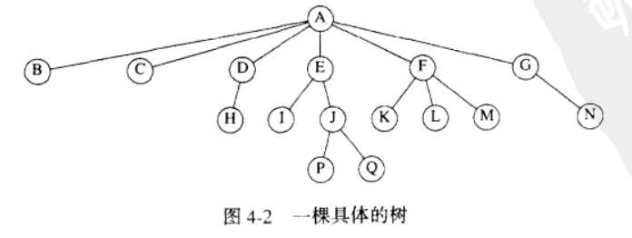
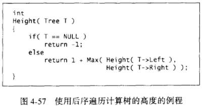
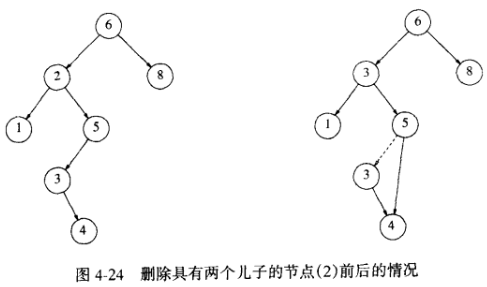
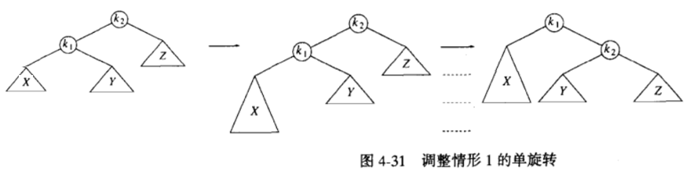
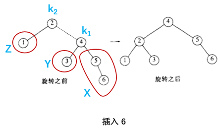
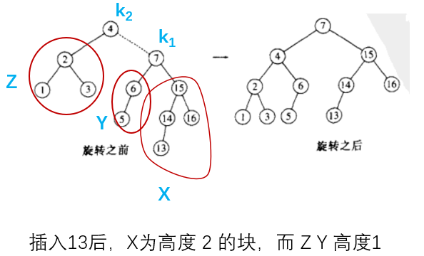
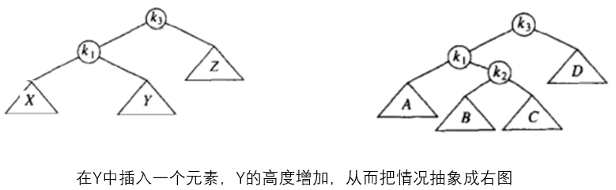
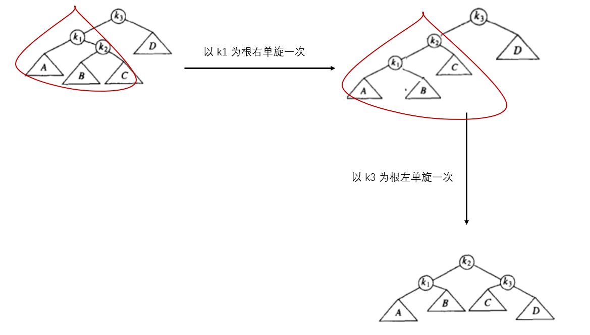
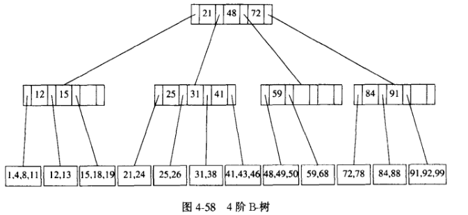

#! https://zhuanlan.zhihu.com/p/441243219
- [树 (tree)](#树-tree)
  - [二叉查找树](#二叉查找树)
      - [特别讨论一下 Delete](#特别讨论一下-delete)
      - [平均情形的分析](#平均情形的分析)
  - [AVL 树](#avl-树)
      - [Insert 操作的具体步骤](#insert-操作的具体步骤)
  - [伸展树](#伸展树)
  - [B-树](#b-树)

---

[回到首页](https://zhuanlan.zhihu.com/p/440338367) ( 进行大纲阅读和相关资源获取 )

---

# 树 (tree)


首先给一些基本概率还是有必要的

深度：**根节点**到 **$n_i$ 节点**经过的边数

$\,$ 高：**$n_i$ 节点**到一个**树叶节点**经过的最长边数

遍历：中序遍历，前序遍历，后序遍历，层序遍历

> 先序遍历标志深度
> 
> 后序遍历标志高度
> 
> 

整个实现在 `ADT/tree_`

---

## 二叉查找树
**binary search tree**

从它的名字来分析它的特征和作用

binary : 一个节点最多直接连接两个子节点

search : 树中储存的元素有顺序

本例我们规定 : 左子树的所有关键字小于节点，右子树的所有关键字大于节点

> 不能同时存储两个一样的节点，通过源代码你会发现，因为相等时的情况我们处理不了

#### 特别讨论一下 Delete
**Delete** 操作是其中最棘手的:

① 它是一片树叶，直接删除

② 它有一个儿子，则它的儿子代替它的位置 ( 这也很好理解 )

③ 它有两个儿子，设删除 $T$ 节点，一般的策略是用 $T$ 的右子树的最小数据代替该节点数据，然后再把最小数据所在节点删除



当然，在删除次数不多时，**懒惰删除**是我们喜欢的：当一个元素要被删除时，它仍然留在树中，只是做一个删除的记号

#### 平均情形的分析
二叉查找树的某个节点的平均深度为 $O(\log N)$ ( $N$ 为树节点个数 )

> 我们非常关注一个节点的深度问题
> 
> 因为一个节点的深度越低
> 
> 那么查找、删除、插入它的时间复杂度就低

不完整的证明如下：( 详见p78 )

定义**内部路径长**：一棵树所有节点的深度的和 (深度上面已定义)

设一棵含有 $N$ 个节点的树，它的**内部路径长** $D(N)$

它由一个根节点以及一棵含有 $i$ 个节点的左子树和一棵含有 $N-i-1$ 个节点的右子树组成

得到关系 $D(N)=(D(i)+i)+(D(N-i-1)+N-i-1)$

所有子树大小都等可能出现，这对于二叉查找树是成立的 ( 子树的大小只依赖于第一个插入树中的元素的秩 )

然后我们直接可以得到 $D(i),D(N-i-1)$ 的平均值都是 $\displaystyle\sum_{j=0}^{N-1}D(j)$ 这个莫名其妙的结论

于是乎 $D(N)=2\displaystyle\sum_{j=0}^{N-1}D(j)+N-1=O(N\log N)$

所有节点的深度的和是 $O(N\log N)$

那么单个节点的深度自然就是 $O(\log N)$

因此我们说二叉查找树的平均查找、删除、插入时间复杂度为 $O(\log N)$

> 什么？你没有看懂？正常，因为我甚至都没写懂。
> 
> 怎么说呢，有些东西还不是这个阶段我们应该掌握的，随便看看就是了吧。期末不考！这更像是数学家或统计学家会研究的事情，我们就算了吧。

---

## AVL 树
二叉查找树的节点的平均深度为 $O(\log N)$

在平均情况下，二叉查找树的性能是好的

毕竟是平均，为了对付极端一点的情况，时刻保证 $O(\log N)$ 的操作效率，我们在此树基础上做一些改进，得到所谓的 **AVL 树**

如下，可以看出我们的改进是多了一项数据 `Height`

用于记录某个节点的**高度** ( 高度定义上面有 )

因为这个事实，AVL tree 的代码实现基本上与 binary search tree 一样，主要是 `Insert` 操作有了变化

**这棵树的特性：**
1. 查找二叉树的一切性质
2. 每个节点的左子树与右子树高度最多差 1

```c
struct AvlNode
{
    ElementType Element;
    AvlTree Left;
    AvlTree Right;
    int Height;
};
```

#### Insert 操作的具体步骤
插入时，我们需要更新所有节点的 `Height` 信息

并且在不满足平衡条件时进行调整

若插入一个元素后 $\alpha$ 节点出现不平衡，插入方式只可能是下面几种情况：
1. 对 $\alpha$ 节点的**左儿子**的**左子树**进行一次插入
2. 对 $\alpha$ 节点的**左儿子**的**右子树**进行一次插入
3. 对 $\alpha$ 节点的**右儿子**的**左子树**进行一次插入
4. 对 $\alpha$ 节点的**右儿子**的**右子树**进行一次插入

( 当然，情况 1 与 4 是镜像对称，情况 2 和 3 是镜像对称 )

① 首先，我们讨论情况 1 

往 $k_2$ 的左儿子的左子树插入一个元素

即往块 X 里插入一个元素

X 变成大三角形表示比 Y 高一层

( 最开始 X Y Z 为大小相同的三角形表示它们都是高度一样的块 )



这种操作是容易实现的

1. 改变一部分的指针指向

2. 更新 $k_1,k_2$ 的高度

实例





② 再是情况 2

往 $k_3$ 的左儿子的右子树插入一个元素，得到不平衡



具体平衡过程如下：



> 关于这个 Insert() 函数代码的实现我实在是解释不清楚。
> 
> 那个递归实在是太绕了
> 
> 删除就更加复杂了
> 
> 如果删除不多，**懒惰删除**会是一个明智的选择

---

## 伸展树
额。。。

---

## B-树
它有多种定义，这些定义在一些次要的细节中不同于我们的定义

阶为 M 的 B-树 具有下列结构特性
* 树的根或是一片树叶，或是儿子数在 $[\,2,M\,]$ 间
* 根外的非树叶节点，儿子数在 $[\,\lfloor\displaystyle\frac{M}{2}\rfloor,M\,] 间$
* 所有树叶在相同深度



它能很好的匹配磁盘，实际用于数据库系统

---