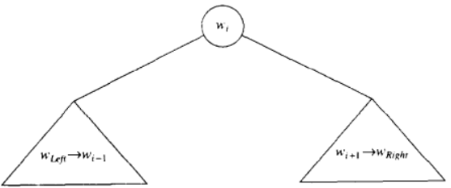
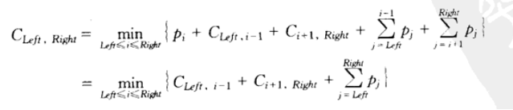

# 最优二叉查找树
已经排序的一些单词 $\omega_{left},\omega_{left+1},\cdots ,\omega_{right}$ 放到二叉查找树

与 Huffman 编码树不完全一样，因为这个要满足二叉查找树的次序条件

`DSAA 292p`
## 原理
若某一刻如图， $\omega_i$ 为根

设 $C_{left,right}$ 为最优期望

则

如果 $left>right$ 那么树的开销是 0 ; 也即 NULL 的情形 ( 见代码 )

## 迭代图

如图 前 6 次迭代记录中间量

以动态归化的思想记录这些中间量，以助于下一次迭代的进行

当第 7 次迭代完成后，**得到了 `a..two` 的最优答案**，且以 `and` 为根

( 几乎是暴力计算了所有的可能 )

## 时间复杂度
虽然几乎暴力讨论了所有的可能性

但是动态规划省下了时间

$O(n^3)$

## 代码 
见 `Dynamic/OptimalBST`