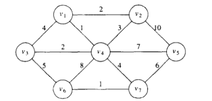
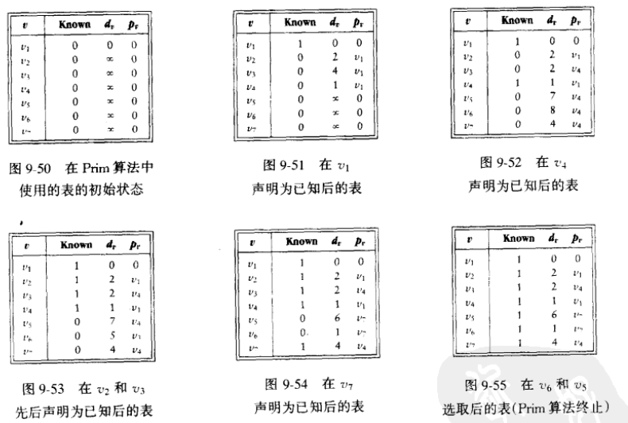
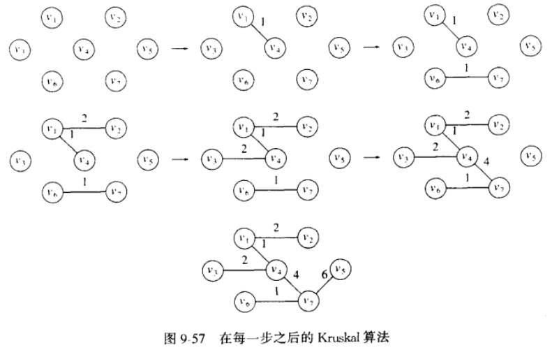
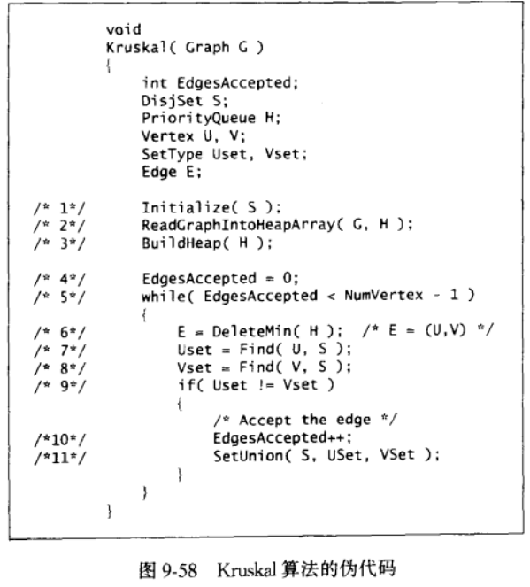

- [最小生成树 ( minimum spanning tree )](#最小生成树--minimum-spanning-tree-)
  - [Prim](#prim)
  - [Kruskal](#kruskal)

---

# 最小生成树 ( minimum spanning tree )

无向图中生成一棵最小树

1. 连通 
2. 没有回路
3. 边的权之和最小

## Prim

==简介==

基于贪婪

==原理==

> 

把 $V_{new}$ 当做一个整体，它们已经连通，这个整体至少与外界的点有一条边，然后这个条边理所应当是 $min(V_{new},v)$

- $v$ 进入 $V_{new}$ 前，不属于 $V_{new}$，所以 $v$ 进来之后**不会增加回路**
- 每次加边都是加的都是有效的 $min$ 所以，**权之和最小**
- 直到 $|V_{new}|=|V|$ 所有点就为一个整体了，即**所有点相互连通**，循环结束

==步骤==

- `Known` 标志该点是否在 $V_{new}$ 中
- `d` 边的权
- `p` 该点的另一头

① 整个流程以 `Dijstra` 求最短路径的思想和步骤为基础

② 优化获取 $min(V_{new},v)$ 的方式 ( 与优化 `Dijstra` 找 `smallest unknown distance vertex` 差不多 )

==复杂度==

| 表的稀疏程度、求 $min(V_{new},w)$ | 时间复杂度                  |
| :-------------------------------- | :-------------------------- |
| 邻接矩阵、遍历整个状态表          | $O(V^2+E)$                  |
| 邻接表、二叉堆                    | $O((V+E)\log V)=O(E\log V)$ |
| 邻接表、斐波那契堆                | $O(E+V\log V)$              |

---

## Kruskal

==简介==

基于贪婪

==原理==

1. 初始状态是所有边组成的森林
2. 给所有边依权值排序
3. 依次访问这些边，当加入它不产生回路，则加入它，否则不进行任何操作，然后访问下一条边
4. 直到加入的边的数量达到 $|V|-1$，跳出循环

==优化==

① 是否产生回路的判断

一个明智的选择是使用 `Union/Find` ( 并查集 )

两个点已经连通当且仅当它们在同一个集合

如果它们已经连通，再加入一个边 $(v,w)$，那一定产生回路

② 边的排序

用线性时间建立一个堆，通过 `DeleteMin` 对边进行遍历

==优化后的伪代码==

==复杂度==

最坏情形运行时间 $O(|E|\log |E|)$，进行 $E$ 次 `DeleteMin()`

图的 $|E|=O(|V|^2)$，所以时间实际也是 $O(|E|\log |V|)$

实践中，算法比这个时间界指示的时间快得多

因为大多时间不会访问完所有的边就结束外循环，`DeleteMin` 也因为不断删除而越来越快
