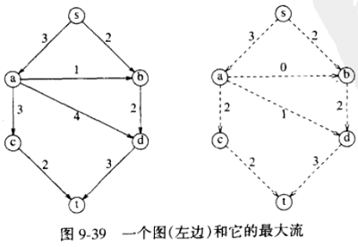
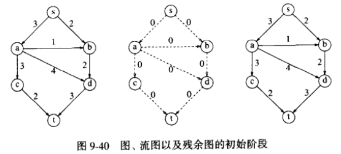
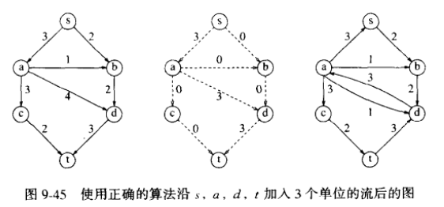
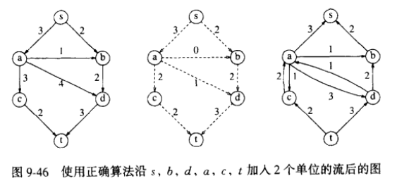

# 最大流问题 ( maximum flow problem )

==介绍==

- 左图：
  * 边上的权可以看作是能负载的最大容量的流
- 右图：
  * 在不违背原则的情况下，最大流算法的结果 ( 从 `s` 流出的流最大 )

==原则==

1. 不违反**边的容量**
2. 保持流守恒

[wiki](https://zh.wikipedia.org/wiki/%E6%9C%80%E5%A4%A7%E6%B5%81%E9%97%AE%E9%A2%98) 详细的说明

## 一个简单的最大流算法

下面系列图的第 3 个为 `残余图 - 流图` 的结果

不直接讨论 `残余图` 是为了防止得到某些坏结果 ( 详见 p233 )

> 有圈时 , 算法也能有效工作
> 
> 证明多少有些困难 , 也超出了本书的范围

## 优化

Traditional network flow algorithms are based on the idea of `augmenting paths`, and repeatedly finding a path of positive capacity from `s to t` and adding it to the flow. It can be shown that the flow through a network is optimal if and only if it contains no augmenting path

体现在找 [增长路径 (augmenting path)](https://stackoverflow.com/questions/10397118/what-exactly-is-augmenting-path) 的方法上，即如何在 `残余图 - 流图` 中找到一条 `s to t` 的路

1. 无权最短路径
2. 赋权最长路径 ( 对 `Dijkstra` 单线修改 )
3. 其他我目前深究不了的算法