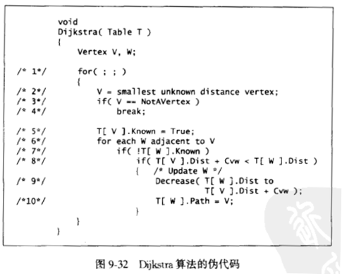

- [最短路径 ( shortest path )](#最短路径--shortest-path-)
  - [Dijkstra](#dijkstra)
  - [Bellman–Ford](#bellmanford)
  - [Floyd](#floyd)

---

# 最短路径 ( shortest path )

## Dijkstra

==简介==

- **单源最短路径算法，图中不能有负权**
  - Dijkstra algorithm is also called single source shortest path algorithm
  - ( 或者说绝大多数 Dijkstra 算法不能有效处理带负权的边 )

- 基于贪婪
  - It is based on greedy technique

==原理==

利用已经找到的点的最短路去推其他点的最短路

==算法正确性==

易证

==伪代码==



==优化==

主要体现在伪代码 `/* 2*/`

1. 普通实现，即遍历整个表得到 `smallest unknown distance vertex`，时间复杂度为 $O(|E|+|V|^2)$
2. 若基于 `Fibonacci heap` 实现则时间复杂度为 $O(|E| + |V|\log |V|)$

---

## Bellman–Ford

==简介==

- 单源最短路径算法
- **能在负权图中正常运行，并判断负圈**
- 基于动态规划

==参考==

- [wiki](https://zh.wikipedia.org/wiki/%E8%B4%9D%E5%B0%94%E6%9B%BC-%E7%A6%8F%E7%89%B9%E7%AE%97%E6%B3%95)
- 视频：[Bellman Ford 单源最短路径算法](https://www.bilibili.com/video/av48431327/)

==原理==

- m 次循环**至少**可以求出从源点到终点大于等于 m 条边构成的最短路的路径
  - 每次循环都遍历每一条边，学术名 “松弛”
  - 每次循环都是在上一次的基础上进行的，基于 DP
- 如果不存在负环，那么当循环次数与边数相等时就保证了有了结果
  - 再细节一点，循环次数达到 $|V|-1$，就能确定结果了

==复杂度==

时间复杂度：$O(|V||E|)$

==伪代码==

```c
procedure BellmanFord(list vertices, list edges, vertex source)
   // 读取边和节点的列表，并写入距离和前任的最短路径

  // 初始化图
  for each vertex v in vertices:
      if v is source 
          distance[v] = 0
      else 
          distance[v] = infinity
      predecessor[v] = null

  // 主循环，松弛操作
  for i from 1 to |V|-1
      for each edge (u, v) with weight w in edges // 一次循环遍历图中的每一条边
          if distance[u] + w < distance[v]
              distance[v] = distance[u] + w
              predecessor[v] = u

  // 检查负圈
  for each edge (u, v) with weight w in edges:
      if distance[u] + w < distance[v]:
           error "negative cycle"
```

==优化==

* 在某次循环 `distance[]` 不再有数值变化，可提前结束循环
* 用队列优化后：SPFA (Shortest Path Faster Algorithm)

---

## Floyd

==简介==

- **对所有点求最短路径的算法，图中不能有负圈**
- 很遗憾不返回路径本身的细节

==原理==

思路与 `Warshell 求传递闭包` 是一模一样

- `Warshall 算法` 是通过每次加入一个顶点，看把这个顶点作为中间顶点是否能改进传递闭包的矩阵，即通过这个新加入的顶点作为中间桥梁，使得原来不可达的 2 个顶点可达，以此逐步向传递闭包逼近

- `Floyd 算法` 通过初试的权重矩阵，每次加入一个顶点，看这个顶点是否能作为中间顶点改变图的权重矩阵，即加入这个中间顶点后，每两个点之间的最短距离是否减小

额外参考：[Floyd 算法](https://zhuanlan.zhihu.com/p/72248451)

==复杂度==

时间复杂度：$O(|V|^3)$

- 当是稠密图时，紧凑的循环让它比用 $|V|$ 次 Dijkstra 算法会更快
- 当是稀疏图时，用 $|V|$ 次优先队列优化的 Dijkstra 算法会更快
