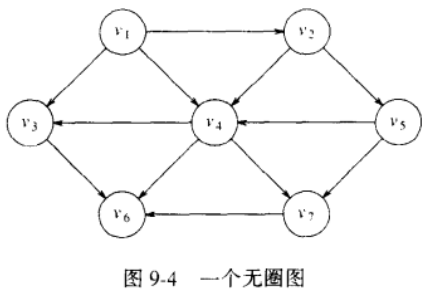
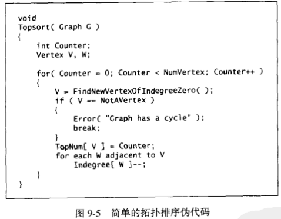
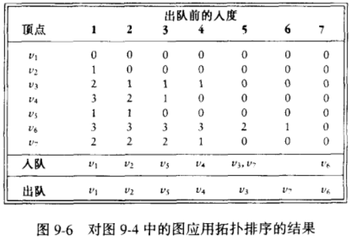
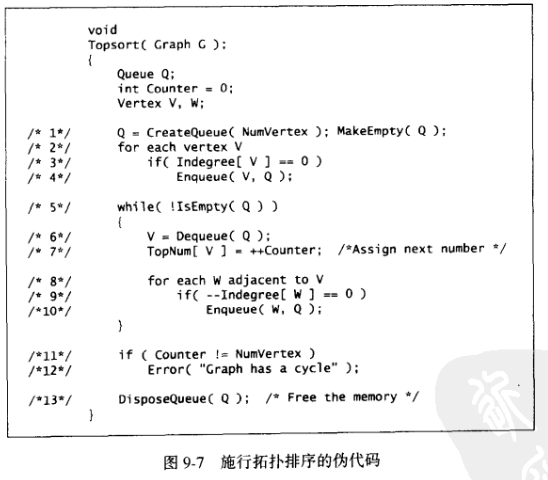

# 拓扑排序 (topological sort)
对**有向无圈图**的顶点的一种排序

( 一般来说，待拓扑排序的图是个稀疏图 )

① 一个简单的求拓扑排序的算法：

1. 先找出任意一个没有入边的顶点
2. 然后记录它，从图中删除它和它的边
3. 更新其他点的入边
4. 对剩余的图进行相同的操作

例子

时间复杂度为 $O({|V|}^2+|E|)$

② 用队列优化后：( Kahn 算法 )

时间复杂度为 $O(|V|+|E|)$

后面还有一种以**深度优先搜索**为核心思想，**栈**为载体的拓扑排序实现方式 ( 我们暂时不讨论，当然，你提前可以[参考这里](https://www.geeksforgeeks.org/topological-sorting/) )