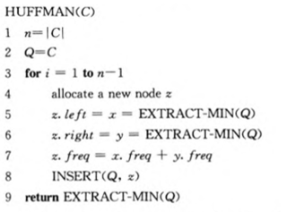

# 贪心

## 活动选择

## 分数背包

## Huffman Coding
==正确性==

① 每一个内部节点都有两个儿子 （ 如果一个内部节点只有一个儿子，把它删了仍然就是一个权更小的树 ）
~~② 低概率的两个值一定为兄弟节点~~
③ 具有最优子结构 （ 反证法 见 `CLRS 249` ）

==伪代码==

## 拟阵
[定义](https://www.cnblogs.com/zqybegin/p/13594765.html)

[拟阵的最优子集问题的贪心算法](https://www.cnblogs.com/zqybegin/p/13594575.html)

[拟阵解决调度问题](https://www.cnblogs.com/zqybegin/p/13596637.html)

> 没必要求出 I ，只需要判断是否独立就可以