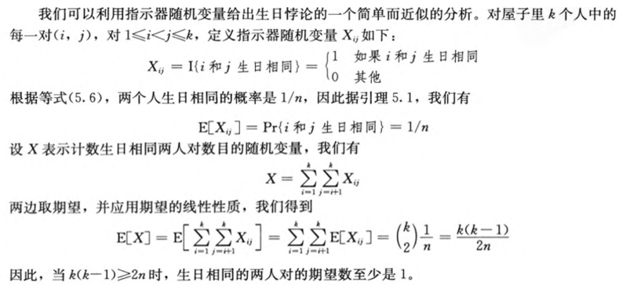

## 生日悖论
一屋子多少人才能使其至少两人同时生日的机会到 50%

1. 一年 365 天
2. 每人每天生日的概率一样

设 $b_i$ 表示编号为 $i$ 的人的生日，总共 $k$ 人

两个人生日不一样的概率 : $P(b_i=r 且 b_j=r)=P(b_i=r)P(b_j=r)=\displaystyle\frac{1}{n^2}$

$k$ 个人生日都不一样的概率 : $P=\displaystyle\frac{A_n^k}{n^k}$

由题目得 : $P<\displaystyle\frac{1}{2}$

$\implies 1 \cdot (1-\frac{1}{n})(1-\frac{2}{n}) \cdots (1-\frac{k-1}{n})<\frac{1}{2} $

经过数学放缩

求出解

见 `CLRS 74`

## 采用指示器变量的一个分析

通过期望

两种方法准确数目不同

但在渐进阶数上都是 $\Theta(\sqrt[]{n})$