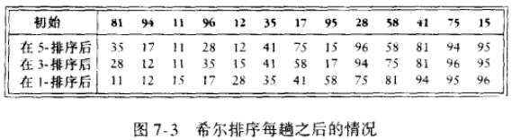
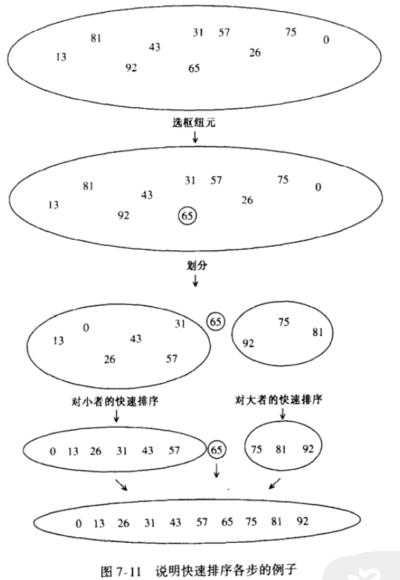
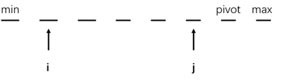
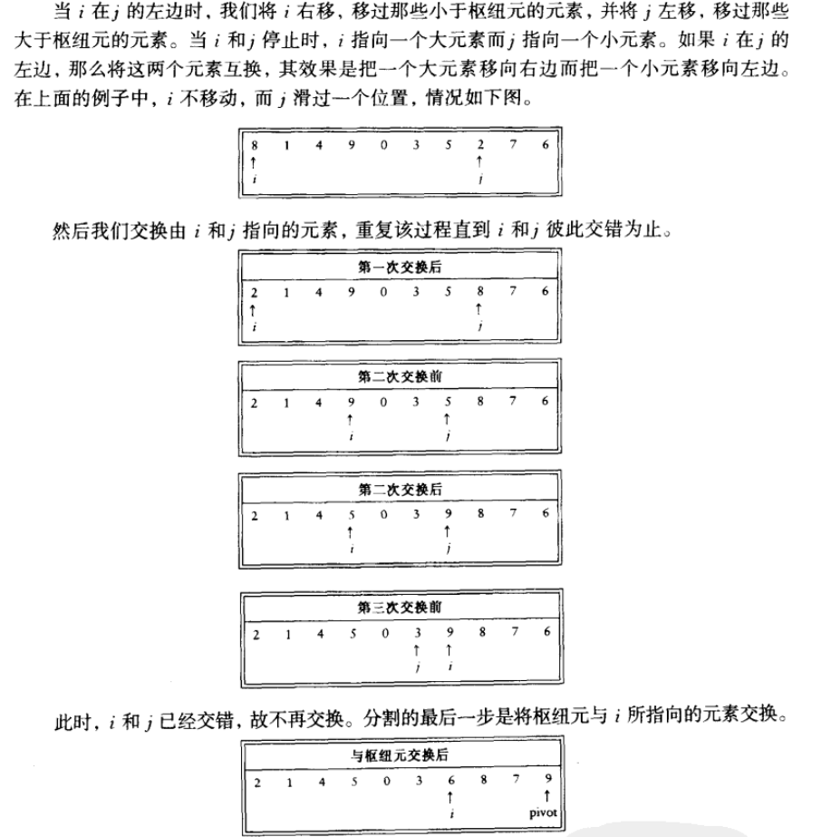

- [排序-part1 (Sort)](#排序-part1-sort)
  - [预备知识](#预备知识)
  - [插入排序 (insertion sort)](#插入排序-insertion-sort)
  - [希尔排序 (Shell sort)](#希尔排序-shell-sort)
  - [快速排序 (quick sort)](#快速排序-quick-sort)

---

[回到首页](https://zhuanlan.zhihu.com/p/440338367) ( 进行大纲阅读和相关资源获取 )

---

# 排序-part1 (Sort) 
经典的数据结构之后就是介绍经典的排序。

在学习排序的过程中体会算法的奥妙，

顺便领略一些数据结构的优越性。( 显然，这一节我们将用到之前的一些数据结构 )

> 由于排序算法过多，我将内容分为两部分
> 
> 第一部分先介绍个人比较喜欢的一些排序
> 
> 代码在 `classic-algorithm/sort/sort1.c`

---

## 预备知识
假设我们排序是由乱序数组得到**从小到大**的顺序

**逆序** : 数组中当 $i<j$ 但 $A[i]>A[j]$ , 这样的一对组合叫一个逆序 ( 排序就是消掉所有逆序数的过程 )

如输入数据 $34,8,64,51,32,21$ 中有 $9$ 个逆序 , 分别是 $(34,8)(34,32)(34,21)(64,51)(64,32)(64,21)(51,32)(51,21)(32,21)$

交换两个不按顺序排列的**相邻元素**，恰好消除一个逆序 ( **这个性质是提高排序算法性能的一个着入点** )

比如交换 $(64,51)$ , 它们相邻 , 交换之后你再数一下逆序个数，你会发现的确只消除了一个逆序

定理

① $N$ 个互异数组成的数组的平均逆序数是 $\displaystyle\frac{N(N-1)}{4}$ ( 详见p167 )( 这个更像是一个统计学上的规律吧？ )
 
---

## 插入排序 (insertion sort)
这便是一个 `交换两个不按顺序排列的相邻元素` 的算法

时间复杂度为 $O(N^2)$ ( 经过上述讨论就很明显了，因为一个数组的平均乱序数为 $\frac{N(N-1)}{4}$ )

之前我们肯定了解过什么 `"暴力排序"` `冒泡排序` 之类的，它们的时间复杂度也是 $O(N^2)$

但是这个插入排序在它们基础上，会有一些细节的优化

这是我最看好的一个 $O(N^2)$ 运行的排序算法，在数组不大，或数组逆序数较小的情况下，它的表现是很良好的

[排序示例点这里](https://www.bilibili.com/video/BV1Ck4y1B7N4?from=search&seid=6896925118381494444&spm_id_from=333.337.0.0)

```c
/* insertion sort */
void InsertionSort(ElementType A[], int N)
{
    int j, P;
    ElementType Tmp;

    for (P = 1; P < N; P++)
    {
        Tmp = A[P];
        for (j = P; j > 0 && A[j - 1] > Tmp; j--)
        {
            A[j] = A[j - 1];
        }
        A[j] = Tmp;
    }
}
```

上述例程基本上可以说没有一点冗杂，每一步都经百般打磨

很漂亮，很专业

特点：

编程简单

一般在输入数据不大，或数据乱序不多时使用

---

## 希尔排序 (Shell sort)
1. 先观看[示例](https://www.bilibili.com/video/BV1vA411u7cT?from=search&seid=9522831910702664624&spm_id_from=333.337.0.0)

希尔排序的核心思想应该是把待排序的数列分割成的很多个子列( 数学意义上的子列，就是那个定理，如果数列有极限，那么它的子列有极限且相等 )，然后对每个子列进行插入排序

这样一来宏观上希尔排序的交换是不限于**相邻元素**的逆序交换

好处就是一次交换可以消除几个逆序 ( 而插入排序是一次只消除一个 )

显然，它的平均时间复杂度比 $O(N^2)$ 小

2. 给出一些解释：

我们使用增量 $h_k$ 完成一次排序之后，对于每一个 $A[i]\leq A[i+k]$ ( 即数组中相隔 $h_k$ 个距离的元素进行比较和交换 )



( 比如图中 `5-排序` 指的是相隔 5 个距离的元素进行比较和排序 )

像图表格第一列的 $\{1,3,5\}$ 这种**增量序列**便是希尔排序的关键

比较经典的**增量序列**就是 `希尔增量序列` $\{1,2,4,...\}$ , 当然 , 严格的说法是 $\{1,...,\displaystyle\frac{\frac{N}{2}}{2},\displaystyle\frac{N}{2}\}$

然后比较牛一点的 `Sedgewick 增量序列` $\{1,5,19,41,109,...\}$ , 最坏运行时间在 $O(N^{\frac{4}{3}})$ , 平均时间应该在 $O(N^{\frac{7}{6}})$ 左右 ( 代码已实现 )

> 关于不同增量序列下的时间复杂度分析我完全看不懂
> 
> 详见p168

3. 使用：

简单的编程使得它在输入数据适度大量时经常被选用 ( 比如数以万计？ )

---

## 快速排序 (quick sort)
集形式美和性能强等优点与一身的排序算法

> 在实践中最快的已知排序算法 ( 见p177 )

[排序视频](https://www.bilibili.com/video/BV1Ft41197RF?from=search&seid=1676751729438650730)

主要步骤：
1. 以**枢纽元**为界，将原数组**分割**为两个数组 ( 一边大于它，一边小于它 )
2. 对每个分裂后的数组进行 1 的操作
3. 整理合并每一次的结果
( 这是分治的思想 )

示例:




几个要点：
1. 选取枢纽元
   
错误 : 选取第一个元素

安全 : 随机选取

最好 : 选择 `三数的中值` ( 数组最右边，最左边，中间位置，这三个数的中位数 )

2. 分割策略 ( 将原数组分割为两个数组的方式 )

在进行三值选取之后，我们得到这样的一个示意图



然后就是 i , j 的遍历与交换

下图是选择 `6` 为枢纽元的一个实列 ( 没有进行三值选取，但不影响我们掌握对 i , j 的遍历与交换的过程 )



遍历结束的条件是 i >= j

3. 截止范围

对于很小的数组，**快速排序**的速度不及**插入排序**

所以我们对递归的调用有一般有一个截止范围

当数组被分割得小于截止数时，我们调用插入排序

**在 $[5,20]$ 比较靠谱**

---
