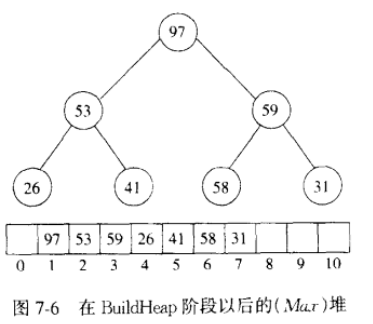
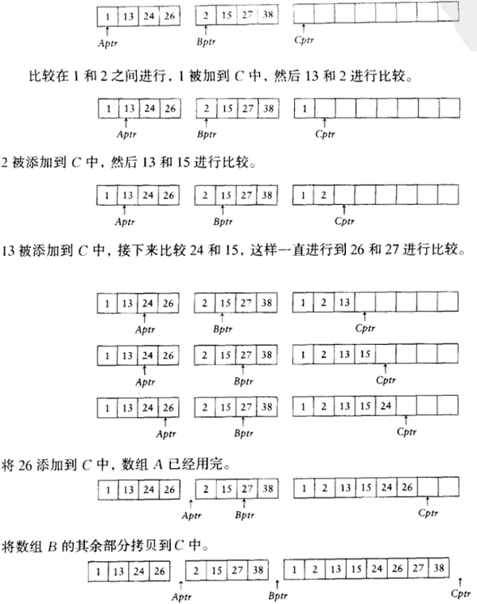

- [排序-part2 (Sort)](#排序-part2-sort)
  - [堆排序 (heap sort)](#堆排序-heap-sort)
  - [归并排序 (merge sort)](#归并排序-merge-sort)
  - [桶排序 (buket sort)](#桶排序-buket-sort)
  - [基数排序 (radix sort)](#基数排序-radix-sort)
  - [排序的一般下界](#排序的一般下界)
      - [决策树](#决策树)

---

[回到首页](https://zhuanlan.zhihu.com/p/440338367) ( 进行大纲阅读和相关资源获取 )

---

# 排序-part2 (Sort) 
代码在 `classic-algorithm/sort/sort2.c`

---

## 堆排序 (heap sort)
有了堆的理论支持，我们便容易地利用堆的数据结构来进行排序

步骤：
1. `BuildHeap` : 以输入的 $N$ 个元素为节点，建立一个以最大数据为根的堆
2. 依次 `DeleteMax`

例如：

考虑输入序列 $31,41,59,26,53,58,97$

97 从堆中被删除，但存储在原数组的最后一位

当所有元素都从堆中删除时，原数组就被排过序了

特点：

运行时间非常稳定，稳定在 $O(N \log N)$

---

## 归并排序 (merge sort)
[视频](https://www.bilibili.com/video/BV1J5411a7Bw?from=search&seid=2883592520845136354)

* 核心思想：

合并两个已经排过序的表

( 经典的分治策略 )

* 时间复杂度分析

我们假设为 $N$ 个元素排序需要时间 $T(N)$ , 且 $T(1)=1$ , 得到下面两个等式

由递推公式得到通项公式是容易的 ( 高中数学 )

所以

* 特点：

难以应用于主存排序

合并两个表需要线性附加内存，且数据在临时数组之间来回拷贝的附加工作使得整个排序的速度被严重放慢

( 拷贝工作可以在递归调用时谨慎地转换 A 和 TmpArray 的角色来避免 )

---

## 桶排序 (buket sort)
排序一些小的整数序列

1. 已知数列中的最大元素 M , 由它来决定桶数
2. 映射函数将数据分开 ( 映射方式可以是①一个数唯一对应一个桶，也可以是②多个数可能对应一个桶然后以链表形式连接 )
3. 遍历桶输出数据

代码已经实现 `①`

`②` 的示意图如下

## 基数排序 (radix sort)
[示例视频](https://www.bilibili.com/video/BV1A54y1D7Kd?from=search&seid=8508806430685224390&spm_id_from=333.337.0.0)

代码已实现

代码的实现与示例视频中有点不一样

---

## 排序的一般下界
我们将证明在平均情况下，只通过比较进行排序任意算法都需要进行 $\Omega (N\log N)$ 次比较

#### 决策树
只通过比较进行排序的算法都可以用**决策树**来表示

树叶为结果的可能，深度为比较的次数

定理
1. 深度为 $d$ 的二叉树，最多有 $2^d$ 个树叶 ( 显然 )
2. 具有 $L$ 片树叶的二叉树的深度至少是 $\lceil\log L\rceil$ ( 由 1 导出 )

那么有 $N$ 个元素排序的决策树一定有 $N!$ 个树叶 ( 对于决策树，树叶是可能的结果 )

即是二叉树深度至少是 $\log N!$

即是需要至少比较 $\log N!$ 次得到结果

---