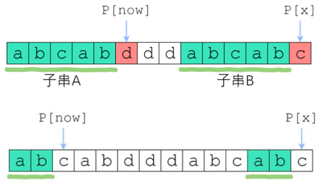

## 关于 "Partial match" table
`KMP` 的一个要点是计算一个 `"Partial match" table`

关于这部分我至少看到两种不同的处理形式

#### 把这部分命名为 `next[]`
约定从左到右 , 在 `sstr` 中找 `tstr`
`next[]` 解释
`next[i]` : 匹配在 `tstr[i] == sstr[j]` 处失败 , 应该跳转到 `tstr[next[i]]` 继续与 `sstr[j]` 匹配 
`next[0]` : 固定为 -1 , 是一种特殊情况 , 在 `tstr[0] == sstr[j]` 处匹配失败 , -1 作为标志 , 下一步为 `tstr[0]` 与 `sstr[j+1]` 匹配

#### 把这部分命名为 `lsp[]`
`lsp[]` : longest proper prefix
eg: S="abcab" 
```
lsp[0] = 0 , always 
lsp[1] = 0 
lsp[3] = 1 
lsp[4] = 2 
```

两种的核心都与 `字串公共前后缀` 相关联 , 只是某些细节的不一样 , 初始条件不一样

---

## 复杂度
设 $N$ 为目标 , $M$ 为模式 , 分别长 $n$ 与 $m$

1. "Partial match" table (failure function) : $O(m)$
2. 搜索 : $O(n)$

一共 $O(m+n)$ ( 平均 )

==解释==

① 

$j$ 的回溯只会影响搜索主循环次数的上下界 $[n, 2n]$

每个字符**平均**回溯 $2$ 次

在这种情况下，对于 $n$ 中的每个字符，实际上都比较了 $2$ 次，所以一共执行了 $2n$ 次循环

这已经是循环次数的上限 , 为 $O(n)$

② 

快速求 `next[]` 思路



```c
if (pat[i] != pat[len])
{
    if (len != 0)
    {
        len = lps[len - 1];
    }
    else
    {
        lps[i] = 0;
        i++;
    }
}
```

[参考这篇文章](https://www.zhihu.com/question/21923021/answer/1032665486) 

与 ① 同样的道理 , 复杂度 $O(m)$

> 详细的推导暂时不会 : 主要指平均的回溯次数相关证明